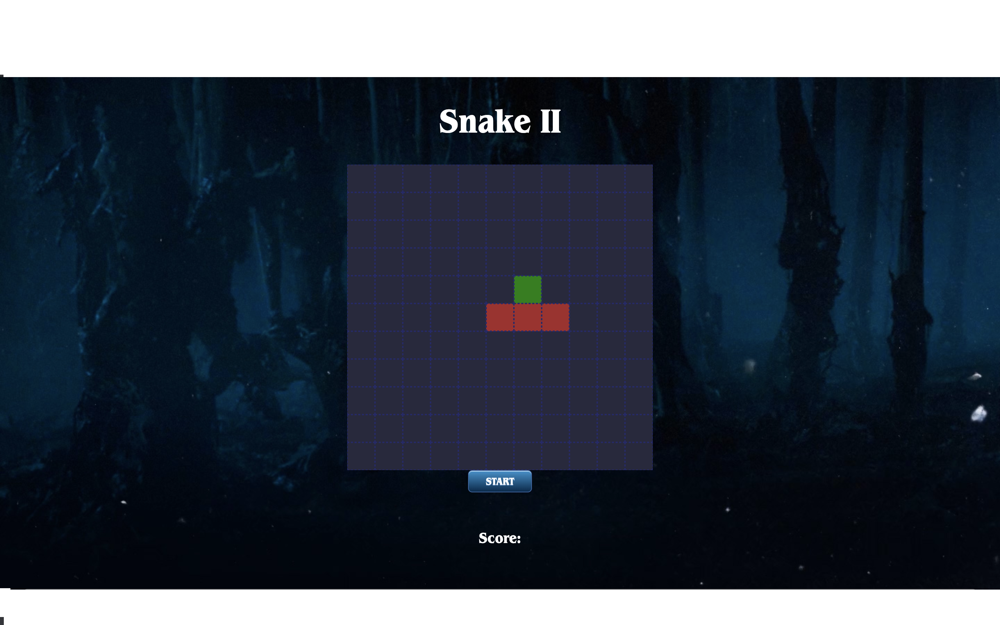
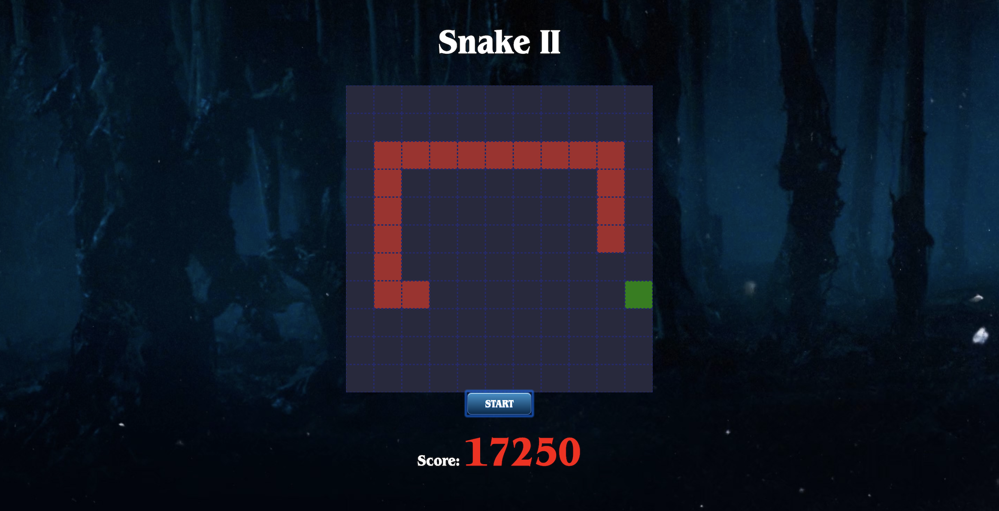
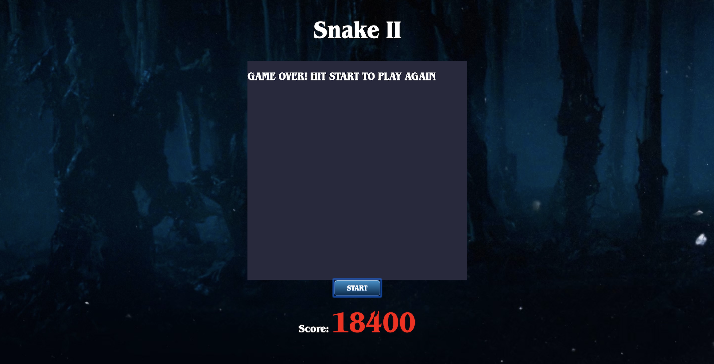

# Software Engineering Immersive: Project 1
This was my first project built whilst studying the Software Engineering Immersive course at General Assembly.
I was given one week to complete this project which was set at the start of week 4 .

# Snake 2

## Brief
- **Render a game in the browser**
- Design logic for winning & visually display which player won
- Include separate HTML / CSS / JavaScript files
- Stick with KISS (Keep It Simple Stupid) and DRY (Don't Repeat Yourself) principles
- Use Javascript for DOM manipulation
- Deploy your game online, where the rest of the world can access it
- Use semantic markup for HTML and CSS (adhere to best practices)
 
## Tech Stack
This project was built using the following technologies.
+ HTML5
+ CSS3
+ JavaScript (ES6)
+ Git & GitHub

## Release History

+ Version 1.0 - This project will not be updated as we had a one week strict deadline and I don’t want to lead anyone into false pretences. This also is to serve as a benchmark for how much I have improved since the date (10/01/20) this was submitted. Any improvements to this project at a later date will be forked and made separately from this repository

## Deployment

The game is deployed utilising GitHub Pages and it can be found (and played 😉) - [here ]( https://jesse2889.github.io/PROJECT-1/)


## Getting Started

If you would like to fork/clone this game to your own repository, please feel free to do so.
You then need to open the index.html file in your browser and the game should start. All images are stored in the games asset folder if you would like to customise the game with your own style.

## Game Architecture

Snake 2 is a single player game. The aim of the game is to navigate the grid and eat as many apples as possible, increasing your score (1150 per apple).



 The challenge is to not bump into the body of your snake which becomes more challenging as you accumulate more points, as your snake will grow longer.

Here you can see the snake has grown after eating numerous apples.



The player cannot let the snake's head touch any part of its body otherwise you will see the game over screen. 



To control the snake the player selects the `up, down, left and right` arrow keys on their keyboard to navigate across the 11 x 11 grid whilst getting closer to the apples.

If an apple is eaten, the player's score will increase by 1150.

The apples are randomly generated so the player will never know which apple will appear next. To do this I built a function that uses the `Math.random()` function which can be seen below.

```js
//Function that creates new apple for the snake on an availabe square
function apple() {
    const appleIndex = Math.floor(Math.random() * squares.length)
    squares[appleIndex].classList.add('apple')
  }

```
When the `apple` function is invoked, the first step is that it randomly chooses where to place the apple on the  `appleIndex` constant via the `Math.random` function in the `apple` constant.

It then runs a filter function on the grid array which is named `squares` and returns all squares that do not contain the class of `player` (the snake's head or body) and places them into the new array `appleIndex`. I then run another `Math.random` function on the available squares so I can randomly choose one of the empty squares so the game isn't predictable.

This is done so that I can make sure the next apple that is generated doesn't appear in a square that is currently occupied.

At the beginning of the game the snake can only occupy three squares, however later into the game it would cause many problems if the food were to spawn on a location already occupied by the player. So by having this function I am able to avoid any collision issues.

## Challenges and Improvements

1. Making sure the collision detection for the snake's head worked

The way I was able to overcome this challenge was by figuring out that I could slice the array that represents the snake. I was then able to check if the square contained any of the other index's of the array when the head of the snake entered the same square. This would then invoke the game over function.

```js
function gameOver() {
    
    clearInterval(timerId)
    grid.innerHTML = ''
    grid.innerHTML = '<h2>GAME OVER! HIT START TO PLAY AGAIN</h2>'
    
    
  }

  ```

2 .Handling the movement of the snake 

  The movement of the snake (`function handleKeyDown`) was created by using an event listener for the player's key presses.
When the player pressed down on any of the arrow keys the keycode was then assign the direction name as the variable (as seen in the code below).

The trick to this was also making sure that the snake can't move in reverse as it has to always move forwards. To do this (for instance on the direction of 'right'), when the player hits the Right arrow key for which the keycode is `39`. I check to make sure the snake isn't already moving towards the left with `if (direction !== 'left')` and invoke the `snakeMovement` function. Also on each movement it does a collision check with the `hit()` function.

```js
function handleKeyDown(e) {
    // console.log(dir)
    switch (e.keyCode) {
      case 39: if (dir !== 'left') dir = 'right'


        break
      case 37: if (dir !== 'right' && dir !== null) dir = 'left' //moveLeft()


        break
      case 40: if (dir !== 'up') dir = 'down'


        break
      case 38: if (dir !== 'down') dir = 'up'


        break
      default:
    }
  }
```

After the `snakeMovement` function was invoked on a certain direction the code below would check to see what the direction variable had been set as and then ran the mathematical equation to get the snake to move in that direction.

```js
function snakeMovement() {
    
    console.log('snakeMove')
    if (dir === 'right') {
      console.log(dir)
      removeSnake()
      if (snake[0] % width === 10) {
        snake[0] -= 10
      }
      snake.pop()
      snake.unshift(snake[0] + 1)
      addSnake()
      
    }
    if (dir === 'left') {
    
      removeSnake()
      if (snake[0] % width === 0) {
        snake[0] += 9
      }

      snake.pop()
      snake.unshift(snake[0] - 1)
      addSnake()
    
    }
    if (dir === 'down') {
     
      removeSnake()
      if (snake[0] >= 110) {
        snake[0] -= 110
      }
      snake.pop()
      snake.unshift(snake[0] + width)
      addSnake()
    }
    if (dir === 'up') {
    
      removeSnake()
      if (snake[0] <= 10) {
        snake[0] += 110
      }
      snake.pop()
      snake.unshift(snake[0] - width)
      addSnake()
    }
    snakeEatsApple()
    hit()

  }
  
  ```
The main issue I came across with the functionality of building the game was the snake moves as expected until it gets to the end of the grid when it is supposed to appear to appear from the opposite side. The head of the snake comes out on the right line but as soon as it does the next segment of the body disappears whilst the snake passes through the wall. You can see a GIF of the issue below

First the snake approaches the edge of the grid. It should appear from the other side on the same line.
As the snake's head passes through to the other side we can see that the next segment of the body disappears leaving an empty square.

### Improvements
The improvements I would like to make on this game would be the following...

1. Fixing the disappearing segment when the snake goes through the wall
2. Making the game mobile responsive so it adjusts to mobile displays and listens for touchscreen presses.
3. I would like to improve the speed of the snake so it makes the game more difficult for the player each time the snake eats the apple. 
4. Adding an extra random apple once the snakes gets to a certain size
5. I would like to definitley refactor the code to make cleaner functions and more readable code.

#### Author
Jesse Golding - You can contact me via [Twitter](https://twitter.com/jes2889 "My twitter profile") or via [email](mailto:jessegolding05@gmail.com "my email").
